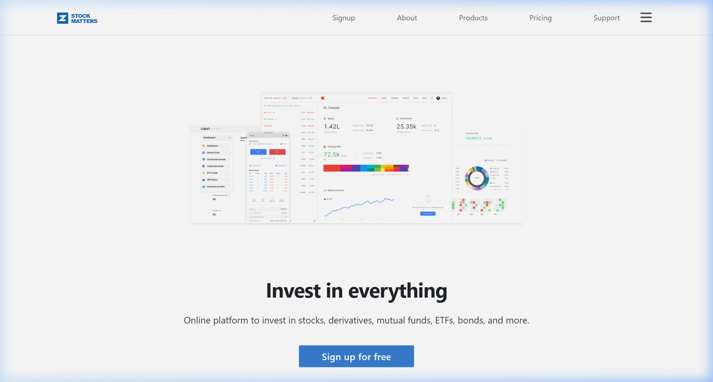
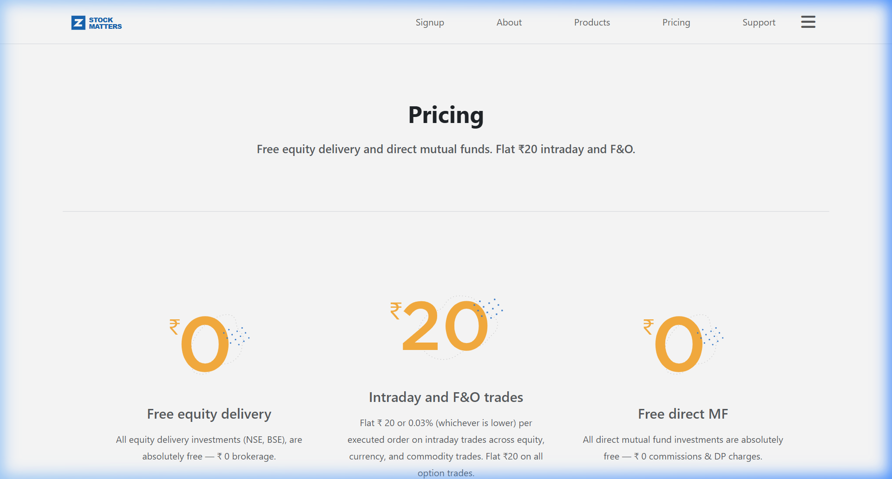
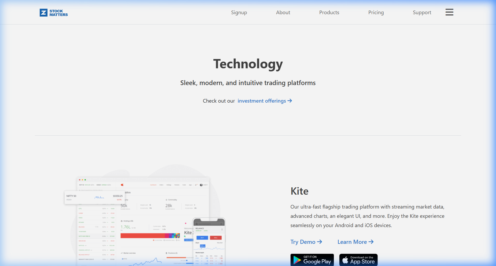
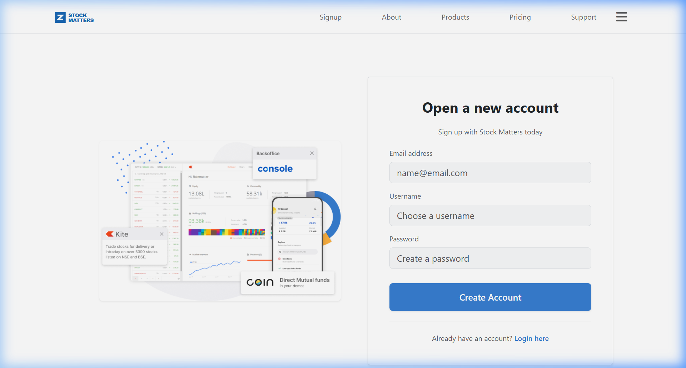
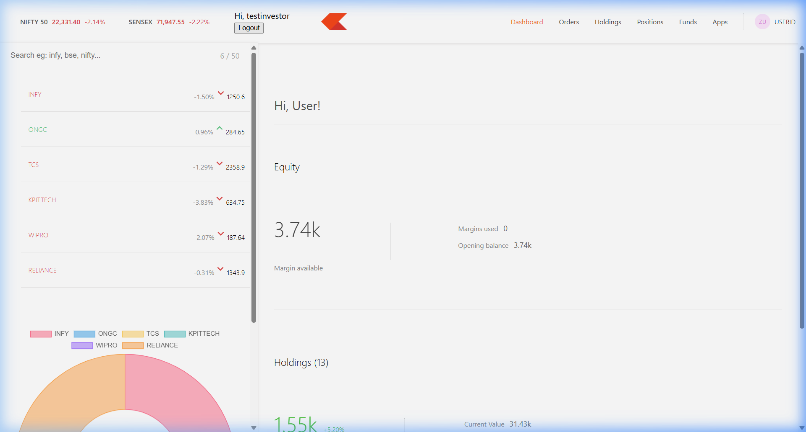

# Stock Matters
A highly modern, responsive FinTech & Retail Brokerage Platform.

### User Interface Showcase






## Overview
**Stock Matters** is a full-stack web application meticulously crafted with the **MERN Stack**. Modeled closely off of robust, institutional-grade Indian brokerage ecosystem platforms like Zerodha, this project aims to provide users with an incredible and sleek first impression, from creating their account to managing their portfolio on the Dashboard.

*(A full video of the platform's UI flow is provided in the repository: `demo_video.webp`)*

## Features Architecture
The platform features a highly modular, decoupled ecosystem consisting of three primary servers:

### 1. The Landing Pages (`/frontend`) 
A standalone React application hosted on Port `3000` dedicated to marketing, onboarding, and education:
*   **Pages:** Home, About, Products, Pricing, Support, Signup, and Login.
*   **Aesthetics:** Polished using modern CSS layout patterns, Bootstrap 5 integration, exact tracking and leading typography spacing, and a consistent `#387ed1` primary brand color scheme.
*   **Navigation:** Uses an expansive and clean mega-menu mimicking industry-standard financial services.

### 2. The Dashboard (`/dashboard`)
A completely separate React application hosted on Port `3001` dedicated to the core experience of trading and analysis (designed for authorized, logged-in users only). Includes:
*   Portfolio tracking (Holdings vs Positions).
*   Live order execution overlays (Buy/Sell logic).
*   Fund tracking logic.

### 3. The Backend Server (`/backend`)
A centralized Node.js/Express framework hosted on Port `3002` acting as the API layer across the ecosystem:
*   **Authentication**: Implements robust JWT-based session security and `bcrypt` password hashing for robust, stateless user authentication.
*   **Storage**: Connects effortlessly to **MongoDB** via `mongoose` to save users, holdings, orders, and market parameters.
*   **Market Data**: Integrated with the advanced `yahoo-finance2` library internally to pull down stock tickers.

## Tech Stack
*   **Frontend Ecosystem:** React.js, React Router DOM, Bootstrap 5 CSS, Axios.
*   **Backend Ecosystem:** Node.js, Express.js, MongoDB (`mongoose`), JSON Web Tokens (`jsonwebtoken`), bcryptjs, cookie-parser.
*   **External APIs:** `yahoo-finance2`.

## How to Run Locally

You must spin up all three servers in independent terminal windows for full interoperability.

1. **Start the Backend Layer**:
   ```bash
   cd backend
   npm install
   # or `node index.js`
   npm run dev
   ```

2. **Start the Landing Page Frontend**:
   ```bash
   cd frontend
   npm install
   npm start
   ```

3. **Start the Core Trading Dashboard**:
   ```bash
   cd dashboard
   npm install
   npm start
   ```

## Next Steps Roadmap
*   Harden JWT HTTP-only settings for deployment to production.
*   Build out explicit socket.io functionality for real-time WebSocket ticker streaming.
*   Tie frontend Buy/Sell orders explicitly into user portfolios updating on the MongoDB layer.

> *Created to break barriers in term of cost, support, and technology. Because your stock matters.*
